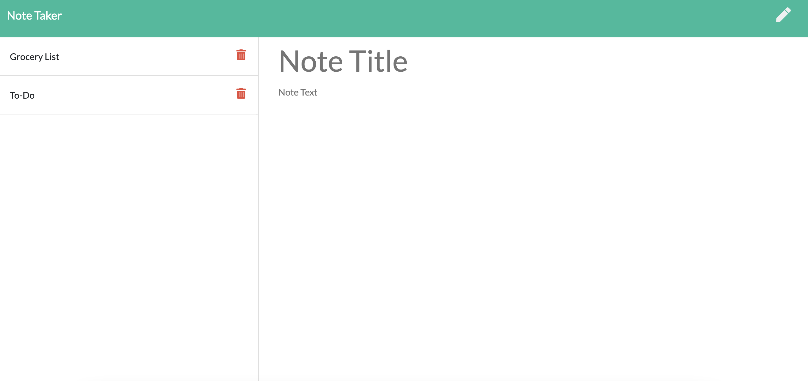

# Note-Tracker

  ## Table of Contents

  [Description](#description)

  [Installation](#installation)

  [Usage](#usage)

  [License](#license)

  [Links](#links)

## Description:
Homework 11 - note tracker. This application uses express servers to store notes generated by the user. The application allows the user to create, store and delete notes.

## Installation:
This application is live on the web via Heroku. Simply access the website:
<a href="https://hrm-note-taker.herokuapp.com/" target="_blank">Note Tracker</a>

## Usage:
Enter the note title and note text where indicated on the application. Save with the disc button, add new with the pencil. Delete notes with the trash button.

## License:
None

## Links:
See below for a list of helpful links:

* <a href="https://hrm-note-taker.herokuapp.com/" target="_blank">Note Tracker</a>
* <a href="https://github.com/HayleyMcHugh/note-tracker.git" target="_blank">My GitHub</a>

Please feel free to reach out to me with any questions! My email can be found on my Github. 